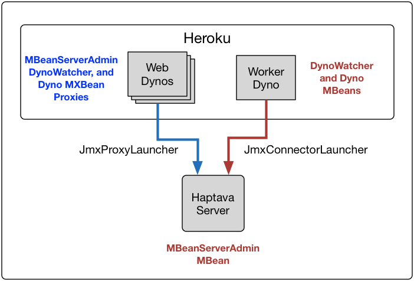

# Heroku Example App

## Overview
This example is designed to run a single `worker` dyno and multiple `web` dynos.

### Worker Dyno
The worker dyno runs a [DynoWatcherServer][dynowatchserver].
It registers a single [DynoWatcher MBean][dynowatchermbean]
with its `platform` MBeanServer and creates a [JmxConnectorLauncher][jmxconnectorlauncher],
which connects its platform MBeanServer to Haptava as `platform@heroku-dyno-watcher-XXXXX`
(where XXXXX is a unique id specific to each Heroku deployment of the heroku-example app).

### Web Dyno
Each web dyno runs a Jetty-based [PageServer][pageserver] and is
initialized in [DynoContextListener][dynocontextlistener].

During initialization, each web dyno:

* Creates a JmxProxyLauncher, which connects its platform MBeanServer to Haptava as `platform@heroku-dyno-XXXXX`.
 
* Starts a JmxProxy on port 8001 that proxies the `usergroup@haptava` MBeanServer.
The `usergroup@haptava` MBeanServer exists on the Haptava server and is available
to all members of the user group.

* Starts a JmxProxy on port 8002 that proxies the `platform@heroku-dyno-watcher-XXXXX` MBeanServer.

* Creates MXBean proxies for:
   * [MBeanServerAdminMXBean][mbeanserveradminmxbean] on the Haptava user group MBeanServer
   * [DynoWatcherMXBean][dynowatchermxbean] on the worker dyno platform MBeanServer
   * [DynoMXBean][dynomxbean] on the worker dyno platform MBeanServer
 
* Registers itself with the DynoWatcherServer, which assigns it a unique name.
The DynoWatcher also registers a
[Dyno MBean][dynombean] for each web dyno.

* Creates 3 servlets:
  * [SummaryServlet][summary] for /summary requests
  * [ResetServlet][reset] for /reset requests
  * [DefaultServlet][default] for /* requests

### Heroku Config Vars
* `HAPTAVA_USERNAME` and `HAPTAVA_PASSWORD` are used for credentials.  
* `APPLICATION_ID` is a unique ID used to avoid collisions between users in the same user group.

## Deploy to Heroku

The heroku-example requires a worker dyno to be running, but the
[Deploy to Heroku][deploydocs] functionality does not allow
worker dynos to be started automatically. So after [deploying][deploy]
the heroku-example app to your [Heroku][heroku] account, adjust the number of dynos
manually:
* Go to [Heroku Dashboard] [dashboard]
* Go to your newly-deployed heroku-example application
* Go to the “Resources” page and increase the number of worker dynos to 1
and the number of web dynos to 5.

If you want to clone the repository, control the dynos with the [Heroku toolbelt][toolbelt]
and view the dyno logs, follow the instructions on the "Deploy" page.

When you are finished experimenting with your heroku-example app, make sure you decrease the
number of worker and web dynos to 0 to avoid charges.

## Running the App

Assuming you named your heroku-example app `foo`, you can reach your app at: `https://foo.herokuapp.com`.

Click on the "Make Request" button to generate some random requests for the app.
For each request you can see:
* The MBeanServer and MBean invoked during the request
* The web dyno that handled the request and a summary it recent requests
* A summary of all the web dynos

You can modify the number of web dynos to any number greater than 0, but do not increase the number of
worker dynos aboce 1.

The summary page embedded in the default servlet is at: `https://foo.herokuapp.com/summary`

Web Dyno requests are reset with: `https://foo.herokuapp.com/reset`

You can view the MBeanServers at: https://api.haptava.io/webdav/MBeanServers/System/Launchers

You can also view the MBeanServers with [Java Mission Control][jmc]
by [starting a local JmxProxyLauncher][jmxproxylauncher].

[dynowatcherserver]: src/main/java/io/haptava/examples/heroku/DynoWatcherServer.java
[dynowatchermxbean]: src/main/java/io/haptava/examples/heroku/mbeans/DynoWatcherMXBean.java
[dynowatchermbean]: src/main/java/io/haptava/examples/heroku/mbeans/DynoWatcherMBean.java
[dynocontextlistener]: src/main/java/io/haptava/examples/heroku/servlets/DynoContextListener.java
[dynomxbean]: src/main/java/io/haptava/examples/heroku/mbeans/DynoMXBean.java
[dynombean]: src/main/java/io/haptava/examples/heroku/mbeans/DynoMBean.java
[summary]: src/main/java/io/haptava/examples/heroku/servlets/SummaryServlet.java
[reset]: src/main/java/io/haptava/examples/heroku/servlets/ResetServlet.java
[default]: src/main/java/io/haptava/examples/heroku/servlets/DefaultServlet.java
[pageserver]: src/main/java/io/haptava/examples/heroku/PageServer.java
[deploydocs]: https://devcenter.heroku.com/articles/heroku-button
[deploy]: https://heroku.com/deploy?template=https://github.com/haptava/heroku-example
[heroku]: http://www.heroku.com
[dashboard]: https://dashboard.heroku.com/apps
[toolbelt]: https://toolbelt.heroku.com/
[jmc]: http://www.oracle.com/technetwork/java/javaseproducts/mission-control/java-mission-control-1998576.html
[jmxconnectorlauncher]: http://docs.haptava.io/jmxconnectorlaunchers.html
[jmxproxylauncher]: http://docs.haptava.io/jmxproxylaunchers.html
[mbeanserveradminmxbean]: http://docs.haptava.io/MBeanServerAdminMXBean.html

